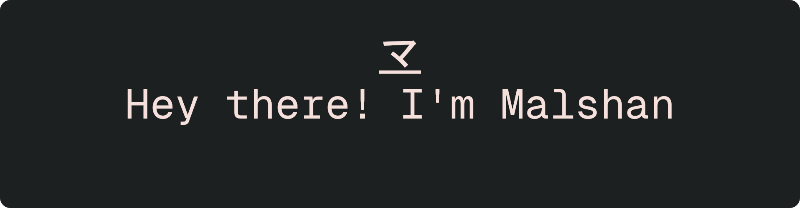

  

⚡ ET Student | L.O Design Team Member | KDE Developer | Graphic Designer

Currently pursuing my studies in Electronics & Telecommunications Engineering in Sri Lanka, I'm passionate about contributing to open-source projects, primarily providing graphical design support. While my coding involvement is less frequent, I focus on improving project documentation, ensuring that README files are clean, reliable, and user-friendly.

🔧 What I Do:

    * FOSS Support: Primarily contributing to the visual and graphical aspects of open-source projects.
    * README Improvements: Making documentation clear, organized, and accessible for all users.
    * Graphic Design: Leveraging my design skills to enhance user experiences in the FOSS community.

💻 Connect with Me:

    * Portfolio Website: malshan.netlify.app [UNDER DEVELOPMENT]

📫 Get in Touch:

    * malshanbandara82 at gmail.com

> Malshan Bandara, UTC+05:30
